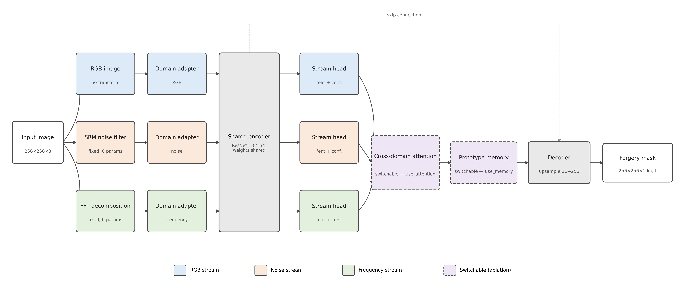
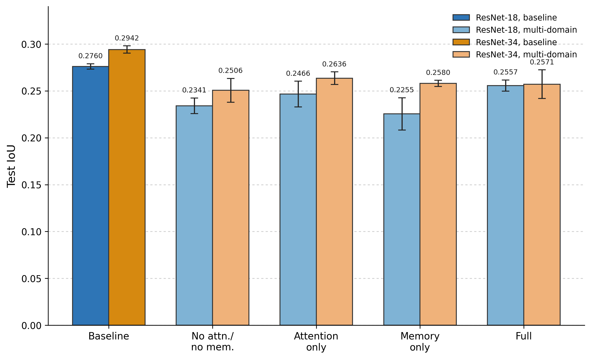
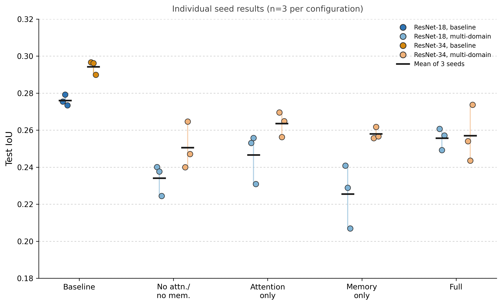
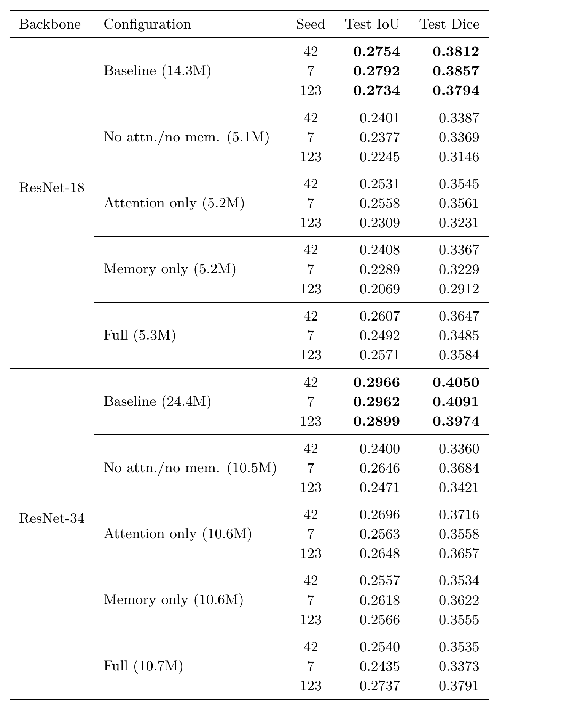

# Multi-Domain-Cross-Attention-Fusion-with-Prototype-Memory-for-Biomedical-Image-Forgery-Localization


Detecting manipulated scientific images — duplicated gel lanes, cloned Western blot bands, recycled microscopy panels — using a segmentation network that fuses RGB, noise-residual, and frequency-domain representations of an image, with cross-domain attention and a prototype memory bank implemented as **switchable components** rather than fixed architectural commitments.

This repository contains the full implementation, training pipelines, and ablation study reported in our paper (see [Citation](#citation)).

---

## Key Finding

A plain single-stream RGB baseline **outperforms every multi-domain fusion configuration tested**, consistently across two backbones (ResNet-18, ResNet-34) and three random seeds, with almost no variance. Within the multi-domain family alone, cross-domain attention gives a small, dependable improvement over an unfused multi-stream model; prototype memory's contribution is smaller and less consistent. Full results and discussion are in the paper.

| Backbone | Baseline IoU | Best multi-domain IoU | Gap |
|---|---|---|---|
| ResNet-18 | **0.276 ± 0.003** | 0.256 (full) | 0.020 |
| ResNet-34 | **0.294 ± 0.004** | 0.264 (attention only) | 0.031 |

---

## Architecture

Three domain streams (RGB, SRM noise residuals, FFT frequency decomposition) pass through stream-specific adapters into a **shared** ResNet encoder, then through per-stream heads. Cross-domain attention and a prototype memory bank are independently switchable, enabling a clean component-wise ablation rather than only evaluating the fully-assembled model.



---

## Results

All five configurations (baseline + 2×2 attention/memory grid) were evaluated on both backbones across 3 seeds — 30 independent training runs, evaluated on a held-out test set never used during model selection.



**Seed variance matters.** An initial single-seed evaluation suggested a sharper interaction between attention and memory than the full three-seed picture supports — a direct illustration of why we report full per-seed results rather than summary statistics alone.



Complete per-seed results for all 30 runs are in [`results/results_log_combined.csv`](results/results_log_combined.csv) and visualized below.



---

## Repository Structure

```
.
├── notebooks/
│   ├── 01_data_audit_and_split.ipynb       # Dataset audit, canonical train/val/test split
│   ├── 02_training_resnet18.ipynb          # Full 15-config ablation grid, ResNet-18
│   ├── 03_training_resnet34.ipynb          # Full 15-config ablation grid, ResNet-34
│   └── colab/                              # Colab-adapted variants (Drive-based, no Kaggle dependency)
├── figures/                                # All paper figures, referenced above
├── results/
│   └── results_log_combined.csv            # All 30 per-seed results (backbone, config, seed, IoU, Dice)
├── paper/
│   └── main.tex                            # Full paper source
└── README.md
```

---

## Dataset

We use the [Recod.AI/LUC Scientific Image Forgery Detection dataset](https://www.kaggle.com/) (Western blot, gel electrophoresis, flow cytometry, microscopy), comprising 2,799 forged images with pixel-level ground-truth masks after pairing and validation. A stratified 70/15/15 split (1,959 / 420 / 420 images) was built using forged-area density bins (micro/small/medium/large) to avoid validation bias toward easy, large forgeries — see `notebooks/01_data_audit_and_split.ipynb` for the full audit and split-generation logic.

---

## Setup

The training notebooks are designed to run on **Kaggle** (recommended — no data download required, competition data is natively mounted) or **Google Colab** (Drive-based variants provided in `notebooks/colab/`).

**On Kaggle:**
1. Open `notebooks/01_data_audit_and_split.ipynb`, attach the competition dataset, run top to bottom. This generates and saves the canonical split.
2. Open `notebooks/02_training_resnet18.ipynb` or `03_training_resnet34.ipynb`, attach the same competition dataset, run top to bottom.

**Dependencies** (installed automatically by the notebooks if missing):
```
torch, torchvision, segmentation-models-pytorch, albumentations, pandas, numpy, scikit-learn
```

---

## Ablation Configurations

Each backbone is evaluated on 5 configurations × 3 seeds (42, 7, 123):

| Configuration | Cross-domain attention | Prototype memory |
|---|:---:|:---:|
| Baseline (single-stream RGB) | — | — |
| Multi-domain, unfused | ✗ | ✗ |
| Multi-domain, attention only | ✓ | ✗ |
| Multi-domain, memory only | ✗ | ✓ |
| Multi-domain, full | ✓ | ✓ |

Training protocol: AdamW (lr=1e-4, weight decay=1e-4), cosine annealing, 40 epochs, mixed precision, effective batch size 16 (physical 4 × gradient accumulation 4). Loss: Focal (α=0.75, γ=2.0) + Dice, equal weighting. Test-time augmentation over 4 flip combinations at evaluation.

---

## Citation

If you use this code or build on this work, please cite:

```bibtex
@inproceedings{multidomainforgery2026,
  title     = {Multi-Domain Cross-Attention Fusion with Prototype Memory for Biomedical Image Forgery Localization},
  author    = {Thamwala, Harshil and Dalal, Tanveer and Maktab Dar Oghaz, Mahdi and Babu Saheer, Lakshmi},
  institution = {Anglia Ruskin University},
  year      = {2026}
}
```

---

## License

This project is released under the MIT License. See [`LICENSE`](LICENSE) for details.

---

## Acknowledgements

Built with [`segmentation_models_pytorch`](https://github.com/qubvel-org/segmentation_models.pytorch) and [Albumentations](https://albumentations.ai/). Dataset provided by [Recod.ai](https://recod.ai/).